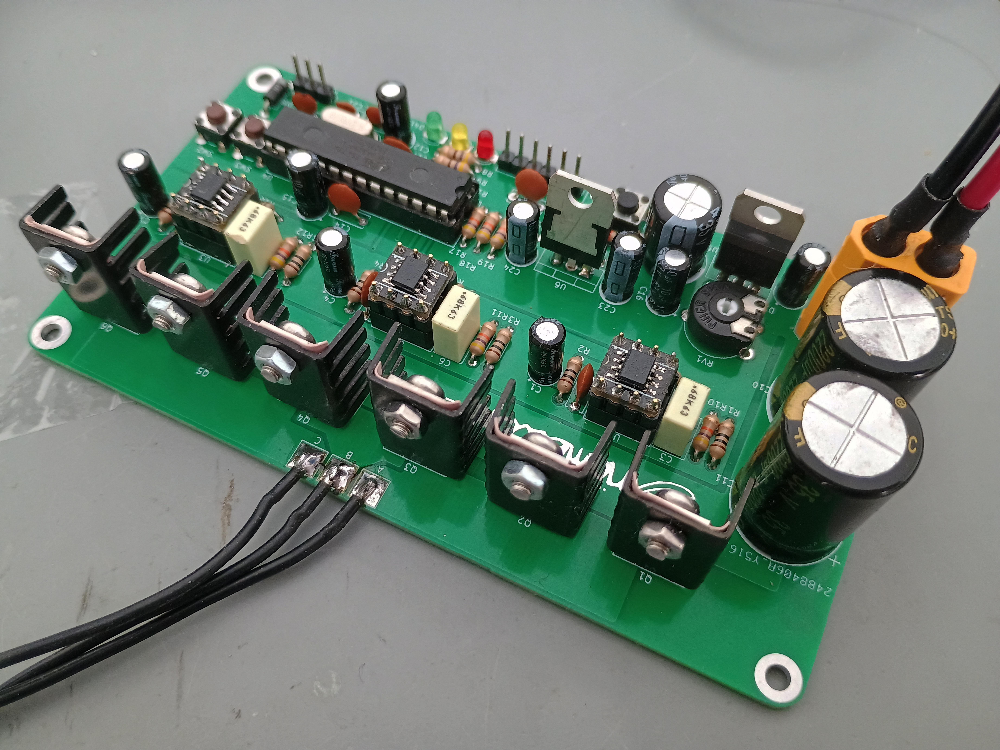

# BLDC motor controller
A brushless DC motor controller developed in partial fulfilment of the requirements for the degree of BEng (Hons) Electronic & Computer Engineering at the University of Brighton.

## Disclaimer
This board is licensed under CERN-OHL-S-2.0.

https://github.com/user-attachments/assets/5595b5e6-1121-481e-8a8e-658866d14e04

